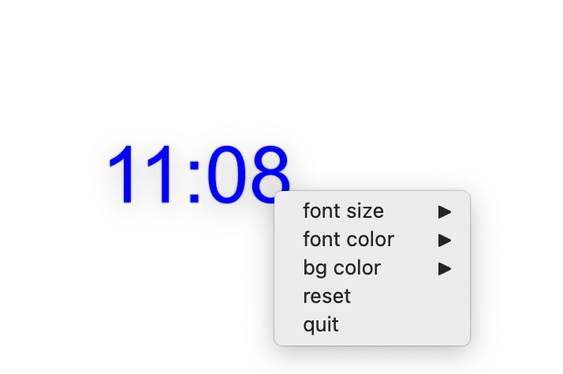

# ⏰ Floating Clock


This project aims to build a cross-platform floating clock based on PySide6 & Qt5.

## Motivation

When coding in full screen mode, I often forget the time.
When on macOS / Linux, the clock on the menu bar is too small to be noticeable, so is the clock on Windows.



## Roadmap

- [ ] Main Window
  - [x] Frameless
  - [x] Drag and Move
  - [x] Right Click Menu
  - [x] Always On Top
  - [ ] Show in Fullscreen Mode
- [x] Font
  - [x] Set Color
  - [x] Set Background Color
  - [x] Change Size
- [x] Configuratin File
  - [x] Read Settings
  - [x] Write Settings
  - [x] Reset Settings
- [ ] Time
  - [ ] Select Time Zone
  - [ ] Set Alarms

## For Testing

```python
python -m pip install -r requirements.txt
```
