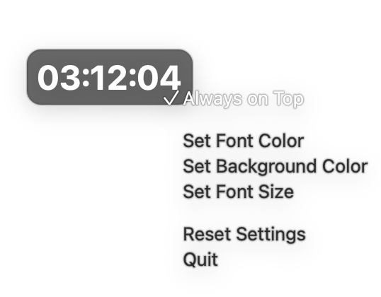

# ☁ Clouck


This project aims to build a cross-platform floating clock based on Qt6.

## Motivation

When coding in full screen mode, I often forget the time.
When on macOS / Linux, the clock on the menu bar is too small to be noticeable, so is the clock on Windows.



## ✨ Features

- Cross Platform
  - [x] MacOS
  - [x] Windows
  - [ ] Linux
- [x] **Main Window**
  - [x] Always On Top
  - [x] Frameless
  - [x] Drag and Move
  - [x] Resizable
  - [x] Show in Fullscreen Mode
- [x] **Style**
  - [x] Right Click Menu
  - [x] Set Background Color
  - [ ] Transparent Background
  - [x] Set Font Color
  - [x] Set FontSize
- [x] **Tweakable** (XML)
  - [x] Read Settings
  - [x] Write Settings
  - [x] Reset Settings
- [ ] **Time Zone**
  - [ ] Select Time Zone

## Quick Start

### Build and Run

#### Quick Build (Recommended)

```bash
# One-click build
./build.sh

# Run application
./build/Clouck.app/Contents/MacOS/Clouck  # macOS
./build/Clouck                           # Linux
```

#### Manual Build

```bash
# Clean build files
./clean.sh

# Generate Makefile
qmake Clouck.pro

# Build
make

# Run
./build/Clouck.app/Contents/MacOS/Clouck  # macOS
./build/Clouck                             # Linux
```

#### Using CMake

```bash
mkdir build && cd build
cmake ..
make
./Clouck
```

## 🚀 GitHub Actions

This project uses GitHub Actions for automated building and releasing:

### CI/CD Workflows

- **CI Build**: Validates builds on all platforms for every push/PR
- **Build Qt**: Comprehensive builds using both qmake and CMake
- **Release**: Creates distributable packages for tagged releases

### Download Pre-built Binaries

Visit the [Releases](https://github.com/ivaquero/clouck/releases) page to download pre-built binaries for:

- **macOS**: DMG installer with native app bundle
- **Windows**: ZIP package with all dependencies
- **Linux**: TAR.GZ package with shared libraries

### Creating a Release

1. Tag a new version:

   ```bash
   git tag v1.0.0
   git push origin v1.0.0
   ```

2. GitHub Actions will automatically build and create a release with binaries for all platforms

### Configuration

The application now uses XML configuration files instead of QSettings. Configuration is stored in `config.xml` with the following options:

- **FontColor**: Font color in hex format
- **BackgroundColor**: Background color with alpha transparency
- **FontSize**: Font size in points (8-72)
- **AlwaysOnTop**: Window always stays on top
- **WindowPosition**: Window position coordinates

The configuration file is automatically created when you first run the application and make changes to settings.

### Usage

- **Move**: Left-click and drag
- **Menu**: Right-click for context menu
- **Customize**: Change colors, font size, always-on-top behavior
- **Configuration**: Settings are saved to `config.xml` and persist between sessions

### Project Structure

```text
qClouck/
├── build/                    # Build output directory
│   ├── Clouck.app/           # macOS application bundle
│   ├── *.o                   # Object files
│   ├── moc_*.cpp            # Qt meta-object compiler output
│   └── Makefile             # Build file
├── config.xml               # XML configuration file
├── build.sh                 # One-click build script
├── clean.sh                 # Clean script
├── Clouck.pro                # qmake project file
├── CMakeLists.txt           # CMake project file
└── README.md
```

### Build Output Management

- All compilation files (.o, moc_*.cpp, Makefile, etc.) are output to `build/` directory
- Executable files are located at `build/Clouck.app/Contents/MacOS/Clouck` (macOS) or `build/Clouck` (Linux)
- Use `./clean.sh` to quickly clean all build files
- Use `./build.sh` for complete one-click build

### Next Steps

- Time zone selection
- Alarm functionality
- Enhanced UI/UX

## Requirements

- Qt6 (Core, Widgets)
- C++17 compatible compiler
- CMake 3.16+ (optional, for CMake build)

## License

See LICENSE file for details.
